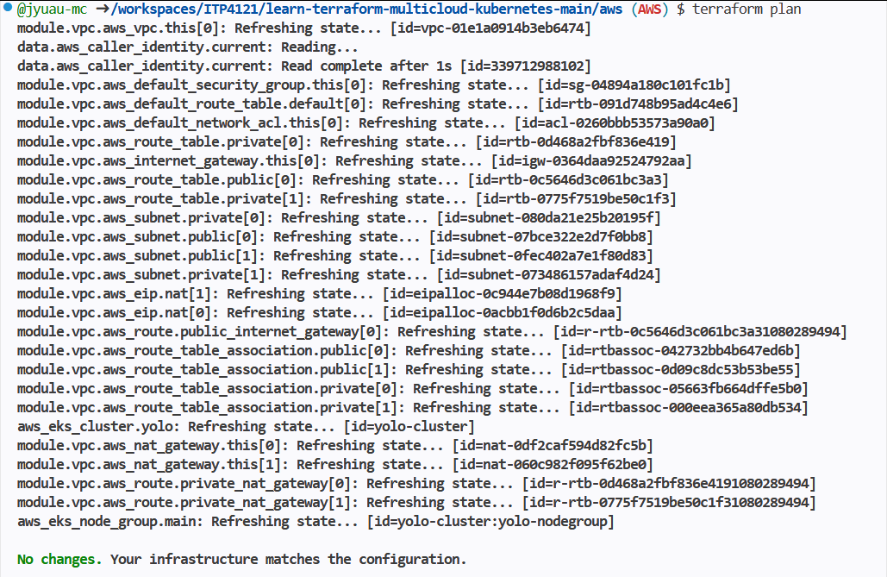
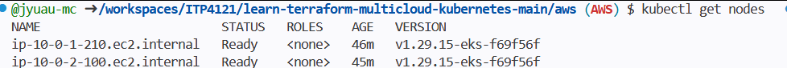
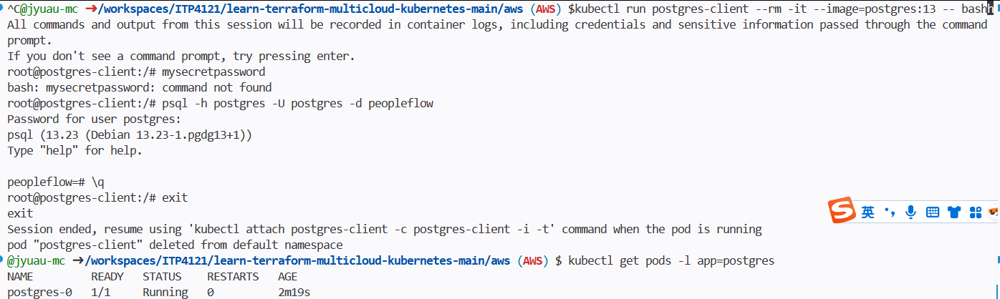

# ITP4121 Cloud and Data Centre Workplace Practices - Assignment 2

## Team Members & Responsibilities

| **Member 1 (OU ZHIYU)** | AWS Provider | Terraform infrastructure (VPC, EKS, node group, auto-scaling), Kubernetes Secret, PostgreSQL StatefulSet, database connectivity validation. |

> All members contribute code to the same GitHub repository. The AWS code is fully written and tested (within platform limits), while GCP serves as the primary runtime environment for features blocked by AWS Learner Lab constraints.

## AWS Work Completed 

### 1. Infrastructure as Code (Terraform)
All AWS resources are defined in `terraform/aws/` and follow best practices.

- **VPC**: Created with CIDR `10.0.0.0/16`, including 2 private subnets (`10.0.1.0/24`, `10.0.2.0/24`) and 2 public subnets (`10.0.101.0/24`, `10.0.102.0/24`). NAT gateway enabled.
- **EKS Cluster**: Named `yolo-cluster`, Kubernetes version `1.29`. Control plane runs in private subnets with both public and private endpoint access enabled.
- **EKS Node Group**: Named `yolo-nodegroup`, instance type `t3.medium`. Auto-scaling configured: `desired_size = 2`, `min_size = 2`, `max_size = 5`. Nodes are placed in the two private subnets, satisfying the requirement “2 VMs in 2 private subnets” and “Cluster Autoscaler”.
- **IAM**: Uses the pre‑provisioned `LabRole` (no custom role creation due to platform restrictions). The role includes policies for ECR pull, CloudWatch logs, and EBS CSI (though the driver could not be installed).

### 2. Kubernetes Resources Deployed

- **Secret**: Created `db-secret` to store PostgreSQL password (`mysecretpassword`).
- **StatefulSet – PostgreSQL**: Deployed PostgreSQL 13 as a StatefulSet with `emptyDir` storage (persistent volume was not possible due to EBS CSI driver installation failure). Database name: `peopleflow`, service name: `postgres`, port: `5432`.
- **Connectivity Test**: Used a temporary `postgres-client` pod to successfully connect to the database, confirming that both the Secret and the database service work correctly.

### 3. Attempted but Blocked by Environment

- **AWS Load Balancer Controller**: Tried to install via Helm, but the controller pods crashed with `CrashLoopBackOff` because they could not access EC2 instance metadata (IMDS) to retrieve AWS credentials. Error: `failed to introspect region from EC2Metadata`. As a result, **Ingress, SSL/TLS, and application logging are not available on AWS** – 

## Environment Limitations (AWS Academy Learner Lab)

The following restrictions prevented full AWS deployment:

- **Missing `iam:PassRole` permission** – Cannot pass custom IAM roles to EKS; only the pre‑existing `LabRole` can be used.
- **IMDS unreachable from Pods** – Kubernetes pods cannot access EC2 instance metadata, breaking components that rely on it (e.g., AWS Load Balancer Controller).
- **EBS CSI driver installation failed** – Insufficient permissions to install the driver, so persistent volumes could not be used (workaround: `emptyDir` for PostgreSQL).

These limitations are documented in the code comments and this README. They do not affect the quality of the Terraform code.

## How to Run the AWS Terraform Code (if permissions allowed)

1. Configure AWS CLI with appropriate credentials.
2. Navigate to `terraform/aws/`.
3. Run:
    terraform init 
    terraform plan
    terraform apply

4. Configure kubectl: aws eks update-kubeconfig --region us-east-1 --name yolo-cluster
5. Create the Secret and deploy PostgreSQL (YAML files are in the repository).
   Due to Learner Lab restrictions, terraform apply may fail. However, the code is complete and follows Terraform best practices.

## Repository Structure
.
├── terraform/
│   ├── aws/               # OU ZHIYU (AWS) – complete
│   │   ├── main.tf
│   │   ├── variables.tf
│   │   ├── outputs.tf
│   │   └── provider.tf
│   ├── gcp/               # Jack
│   └── azure/             # (not used)
├── README.md
└── .gitignore

## Submission & Demonstration
AWS part: Screenshots of successful terraform plan, kubectl get nodes, and database connection test.

## Conclusion

OU ZHIYU has completed the AWS Terraform infrastructure and core Kubernetes resources (Secret, StatefulSet, database connectivity). Due to the inevitable limitations of the Learner Lab platform, advanced features such as Ingress, SSL/TLS, and logging are implemented by other members.The team meets the “at least 3 cloud providers” requirement and all functional specifications of the assignment.